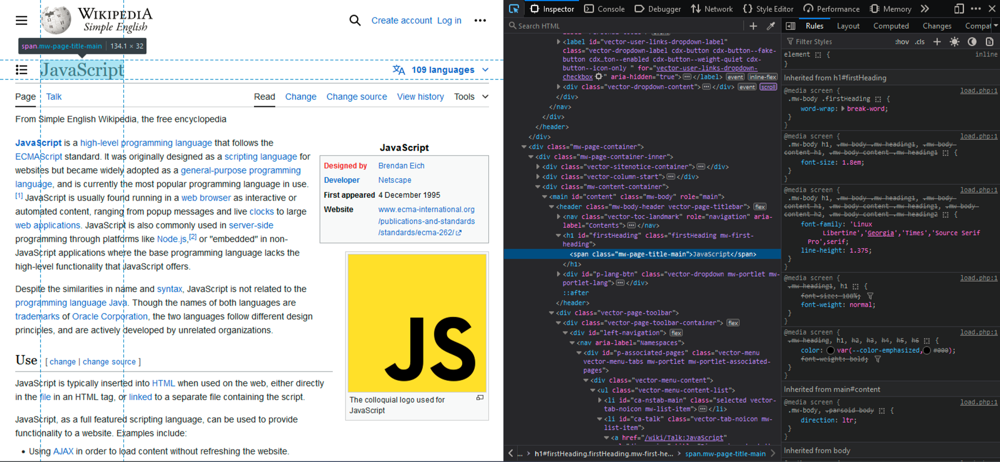
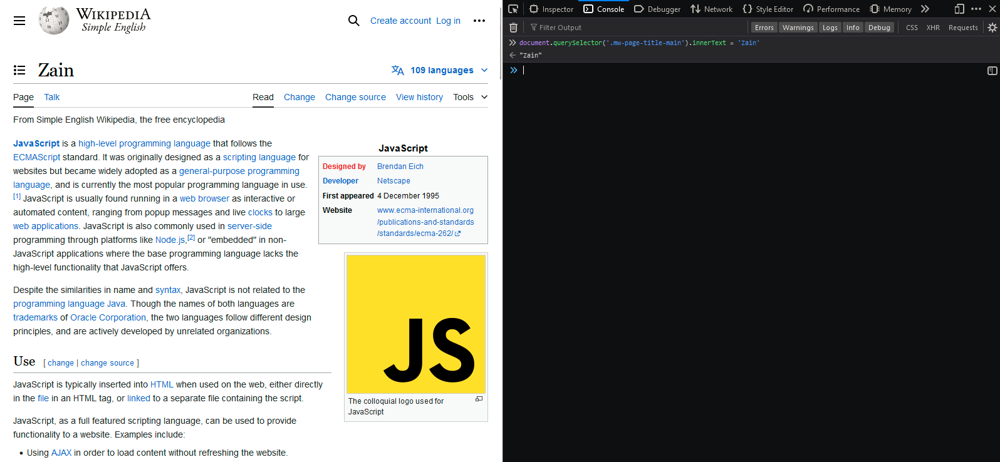
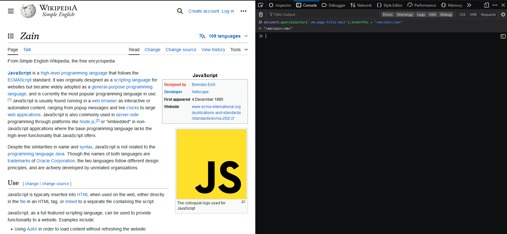
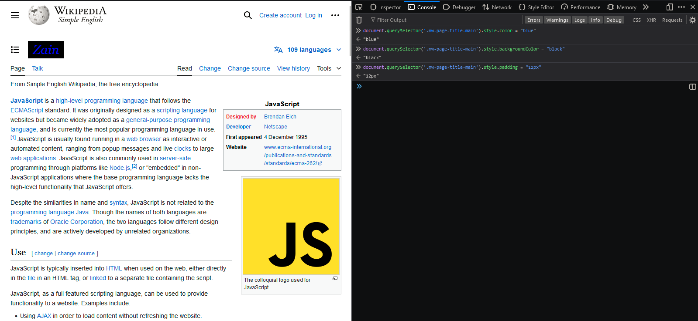
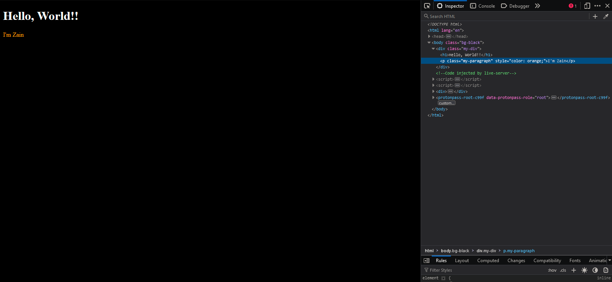

# Document Object Model

The DOM is a programming interface for web documents.

It represents the page so that programs can change the document structure, style, and content.

**Structure:**

- **Tree Structure:** The document is represented as a tree of nodes.
  - **Root Node:** `document` object, representing the whole HTML document.
  - **Element Nodes:** Represent HTML elements (e.g., `<div>`, `<p>`).
  - **Text Nodes:** Represent text content inside elements.
  - **Attribute Nodes:** Represent attributes of elements (e.g., `class`, `id`).
  - **Comment Nodes:** Represent comments in the HTML.

**Node Types:**

1. **Element Nodes:** HTML tags (e.g., `<div>`, `<a>`).
2. **Text Nodes:** Text content within elements.
3. **Comment Nodes:** HTML comments (`<!-- comment -->`).
4. **Document Nodes:** Entire HTML document.
5. **DocumentType Nodes:** Document type declaration (`<!DOCTYPE html>`).
6. **Attribute Nodes:** Attributes of elements.

**Key Interfaces:**

- **`document`:** Entry point to the DOM. Represents the entire HTML or XML document.
- **`element`:** Represents an element node. Provides methods like `getElementById`, `getElementsByClassName`, and `querySelector`.
- **`node`:** Base class for all node types.

**Common Methods:**

- **Accessing Elements:**
  - `document.getElementById('id')`: Returns the element with the specified ID.
  - `document.getElementsByClassName('class')`: Returns a live `HTMLCollection` of elements with the specified class.
  - `document.getElementsByTagName('tag')`: Returns a live `HTMLCollection` of elements with the specified tag name.
  - `document.querySelector('selector')`: Returns the first element matching the CSS selector.
  - `document.querySelectorAll('selector')`: Returns a static `NodeList` of all elements matching the CSS selector.
- **Modifying Elements:**
  - `element.innerHTML = 'HTML content'`: Sets or gets the HTML content of an element.
  - `element.textContent = 'Text content'`: Sets or gets the text content of an element.
  - `element.setAttribute('attr', 'value')`: Sets the value of an attribute.
  - `element.classList.add('class')`: Adds a class to the element.
  - `element.classList.remove('class')`: Removes a class from the element.
- **Creating and Inserting Elements:**
  - `document.createElement('tag')`: Creates a new element node.
  - `element.appendChild(node)`: Appends a node as the last child of the element.
  - `element.insertBefore(newNode, referenceNode)`: Inserts a node before a reference node.

**Collections:**

- **NodeList:** Can contain any type of node. Static or live.
  - Example: `document.querySelectorAll('div')` returns a static NodeList.
- **HTMLCollection:** Contains only element nodes. Always live.
  - Example: `document.getElementsByClassName('example')` returns an HTMLCollection.

**Key Properties:**

- `element.innerHTML`: Gets or sets the HTML content.
- `element.innerText`: Gets or sets the visible text content.
- `element.textContent`: Gets or sets the text content including hidden text.

## Window Object

```jsx
console.log(window);
```

This will display the `window` object. The `window` object represents the current browsing context in the browser, including the global JavaScript objects, functions, and variables available to the current page.

```jsx
console.log(document);
```

The `window` object in a browser environment typically contains properties such as `document` (which represents the current HTML document).

## DOM Selectors

JavaScript give us a bunch of DOM selector methods that are present in the `document` object.

```jsx
document.getElementsByClassName("myClass");
document.getElementById("myID");
document.querySelector(".myClass");
document.querySelector("#myID");
document.querySelectorAll(".myClass");
document.querySelectorAll("#myID");
document.querySelectorAll("h1");
```

These are some of the common selectors in JS. There are many other. These selectors helps us to select HTML elements from the web page.

## Manipulating Web Page

[https://simple.wikipedia.org/wiki/JavaScript](https://simple.wikipedia.org/wiki/JavaScript)

Lets manipulate the Heading 1



```jsx
document.querySelector(".mw-page-title-main").innerText = "Zain";
```



The `innerText` method allows us to change text present in an HTML tag.

You can use below mentioned methods and they will also do the same job

```jsx
document.querySelector(".mw-page-title-main").innerHTML = "Zain";
document.querySelector(".mw-page-title-main").textContent = "Zain";
```

They are all similar, then whats the difference?

`innerText` and `textContent` focus on text content manipulation, while `innerHTML` allows manipulation of both text and HTML content within an element. Additionally, `innerText` and `textContent` are safer when working with user-generated content as they do not parse HTML, thus reducing the risk of XSS (cross-site scripting) attacks.

```jsx
// With innerHTML you can manipulate HTML
document.querySelector(".mw-page-title-main").innerHTML = "<em>Zain</em>";
```



If lets say, something is hidden on the page, `innerHTML` and `textContent` methods will retrieve them too but `innerText` will not.

## Styling a Page

JavaScript also allows us to manipulate the styles of a page

```jsx
document.querySelector('.mw-page-title-main').style.color = "blue
document.querySelector('.mw-page-title-main').style.backgroundColor = "black"
document.querySelector('.mw-page-title-main').style.padding = "12px"
```



## Creating HTML Elements

```html
<!DOCTYPE html>
<html lang="en">
  <head>
    <meta charset="UTF-8" />
    <meta name="viewport" content="width=device-width, initial-scale=1.0" />
    <title>DOM</title>
  </head>
  <style>
    .bg-black {
      background-color: black;
      color: white;
    }
  </style>

  <body class="bg-black">
    <div class="my-div">
      <h1>Hello, World!!</h1>
    </div>
  </body>
</html>
```


Here we’ve just created a simple web page. We’re going to create a new `p` tag and will append it into the `div`

```html
<script>
  const div = document.querySelector(".my-div");
  const p = document.createElement("p");
  p.textContent = "I'm Zain";
  p.setAttribute("class", "my-paragraph");
  p.style.color = "orange";
  div.appendChild(p);
</script>
```



The `createElement()` method allows us to create HTML tags and `setAttribute()` method allows us to add attributes to our HTML. The `appendChild()` child method appends the newly created HTML element into a parent element.
