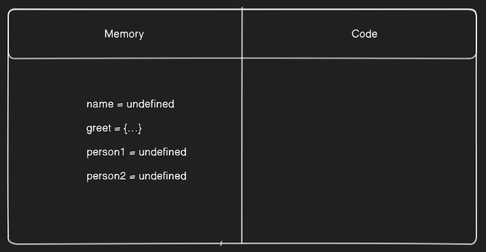

# How JS executes code?

## What is Execution Context?

Whenever a JS code is executed, the JavaScript engine (Browser or Node.js) creates an environment that is called **Execution Context**. This execution context handles all the execution of the code.

### Types of Execution Context

There are two types of EC:

- Global Execution Context
- Function Execution Context

The Global EC is created when a JS code first starts to run and it represents the global scope in JS.

The Function EC is created when a function is called and it represents that function’s local scope.

### Phases of Execution Context

There are two phases of EC:

- Memory Creation Phase
- Execution Phase

In Memory Creation Phase, memory is allocated for all the global variables, functions or objects. It also sets the **Scope Chain** for the execution context. Scope chain basically tells about the scope of a particular variable or any object.

In Execution Phase, the code is executed line by line, all the function calls or mathematical operations are done here.

### Components of Execution Context

There are two components of EC:

- Memory
- Code

### Example

Consider the following example:

```jsx
let name = "Zain";

function greet(n) {
  let greetHello = `Hello, ${n}`;
  return greet;
}

let person1 = greet(name);
let person2 = greet("Ali");
```

So, when this code will get executed, first the Global Execution Context will be made and then Memory Creation Phase will start and it will allocate the memory for all the global variables and the `greet` function and they will be stored in the Memory Component.

Our Components will look something like this:



After the memory creation phase, the Execution Phase will start, where the entire code will be read line by line from top to bottom. When the phase encounters `name = “Zain”` , the value “Zain” will be assigned to `name` variable in memory. After that, the phase will encounter `greet` function, but it already is in the memory and hasn’t been called yet so the Execution Phase will directly jump to `person1 = greet(name)` . Now, here the function is being called so a Function Execution Context will be made for this particular function call.

Our Components will look something like this now:


Once the function is executed, it will return the value and `person1` will be assigned with value “Zain” and the function execution context will be destroyed. Same process will happen for the subsequent function call and `person2` will be assigned with value of “Ali”.

Our final diagram will look something like this:


## What is Call Stack?

The Call Stack keeps track of all the Execution Contexts, whether it is Global or Functional. As we know that a stack works upon LIFO (Last In First Out) Principle so when a JS code first starts to execute, Global Execution Context is made and is pushed into the stack and whenever a Function gets executed and its Function Execution Context is made, it also gets pushed into the stack.

When the Function Execution ends, its Context is popped out of the stack.
